---
## :hammer_and_wrench: Languages and Tools :

### Frontend:

### Backend:

### Databases & Data:

### System Administration:

### Plus:

### 📊 My GitHub Statistics

 

<!---
rain64x/rain64x is a ✨ special ✨ repository because its `README.md` (this file) appears on your GitHub profile.
You can click the Preview link to take a look at your changes.
--->
